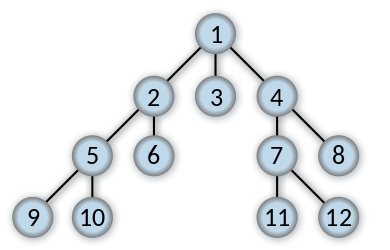

# Algorithms

## Sorting

### Bubble sort

Bubble sort is sorting algorithm that repeatedly steps through the list, compares each pair of adjacent items and swaps them if they are in the wrong order. The pass through is repeated until no swaps are needed, which indicates that the list is sorted.

Although the algorithm is simple, it is too slow and impractical for most problem. Bubble sort has worst-case & average time complexity of O(n²) and a space complexity of O(1).

Example implementation of bubble sort:

```python
def bubblesort(array):
    while True:
        swapped = False

        for i in range(0, len(array)-1):

            if array[i] > array[i+1]:
                array[i], array[i+1] = array[i+1], array[i]
                swapped = True

        if not swapped:
            break
    return array
```

### Merge sort

Merge sort is an efficient sorting algorithm. Conceptually, a merge sort works as follows:

- Divide the unsorted list into n sublists, each containing 1 element (a list of 1 element is considered sorted).
- Repeatedly merge sublists to produce new sorted sublists until there is only 1 sublist remaining. This will be the sorted list.

Merge sort has worst-case & average time complexity of O(n log n) and a space complexity of O(n) (due to the helper array). Merge sort also works well in a parallel setting.

Example implementation of merge sort:

```python
def merge_sort(array):
    helper = [None] * len(array)
    _merge_sort(array, helper, 0, len(array) - 1)
    return array

def _merge_sort(array, helper, low, high):
    if low < high:
        mid = (low + high) // 2

        _merge_sort(array, helper, low, mid)
        _merge_sort(array, helper, mid+1, high)
        merge(array, helper, low, mid, high)

def merge(array, helper, low, mid, high):
    for i in range(low, high+1):
        helper[i] = array[i]

    left_pointer = low
    right_pointer = mid + 1
    current = low

    while left_pointer <= mid and right_pointer <= high:
        if helper[left_pointer] < helper[right_pointer]:
            array[current] = helper[left_pointer]
            left_pointer += 1
        else:
            array[current] = helper[right_pointer]
            right_pointer += 1
        current += 1

    # Copying the remaning elements
    if left_pointer < mid:
        remaning = mid - left_pointer

        for i in range(0, remaning+1):
            array[current + i] = helper[left_pointer+i]
    else:
        remaning = high - right_pointer
        for i in range(0, remaning+1):
            array[current + i] = helper[right_pointer+i]
```

### Quick sort

Quicksort is a divide and conquer algorithm. Quicksort first divides a large array into two smaller sub-arrays: the low elements and the high elements. Quicksort can then recursively sort the sub-arrays.

The steps are:

- Pick an element, called a pivot, from the array.
- Partitioning: reorder the array so that all elements with values less than the pivot come before the pivot, while all elements with values greater than the pivot come after it (equal values can go either way). After this partitioning, the pivot is in its final position. This is called the partition operation.
- Recursively apply the above steps to the sub-array of elements with smaller values and separately to the sub-array of elements with greater values.

The algorithm has an average time complexity of O(n log n) and worst-case time complexity of O(n²), though this behavior is rare. The space complexity is O(log n) (due to the recursive call stack).

Example implementation of quicksort:

```python
def quick_sort(array):
    _quick_sort(array, 0, len(array) - 1)
    return array

def _quick_sort(array, start_index, end_index):
    pivot_index = pivot(array, start_index, end_index)

    if start_index < pivot_index - 1:
        _quick_sort(array, start_index, pivot_index - 1)

    if pivot_index + 1 < end_index:
        _quick_sort(array, pivot_index + 1, end_index)

def swap(array, start_index, end_index):
    array[start_index], array[end_index] = array[end_index], array[start_index]

def pivot(array, start_index, end_index):
    pivot_element = array[(start_index + end_index) // 2]

    while start_index < end_index:
        while array[start_index] < pivot_element:
            start_index += 1

        while pivot_element < array[end_index]:
            end_index -= 1

        if start_index < end_index:
            swap(array, start_index, end_index)
            start_index += 1
            end_index -= 1

    return start_index
```

One needs to be careful when choosing the pivot element. For example, if one chooses the leftmost element for the pivot, it would cause worst-case behavior on already sorted arrays. The problem is solvable by choosing either a random index for the pivot or choosing the middle index of the partition.

### Comparing different sorting algorithms

- Bubble sort is impractical for most problem.
- Quicksort is often faster than merge sort in practice.
- Quick sort is an in-place sorting algorithm.
- Merge sort requires a temporary array to merge the sorted arrays, giving quick sort the advantage of space.

## Search

### Depth first search

Depth-first search is an algorithm for traversing or searching tree or graph data structures. The algorithm starts at the root node (selecting some arbitrary node as the root node in the case of a graph) and explores as far as possible along each branch before backtracking.

The picture below is an example in which order the nodes are visited:


It has a worst-case time complexity of O(|V| + |E|) and worst-case space complexity of O(|V|).

### Breath first search

Breadth-first search is an algorithm for traversing or searching tree and graph structures. It starts at the root node (selecting some arbitrary node as the root node in the case of a graph) and explores the neighbor nodes first, before moving to the next level neighbors.

The picture below is an example in which order the nodes are visited:



It has a worst-case time complexity of O(|V| + |E|) and worst-case space complexity of O(|V|).

### Depth first search versus breath first search

#### DFS

- Tend to be a recursive algorithm.
- Tend to be easier to implement than bfs since it's recursive.

#### BFS

- BFS finds the shortest path between two nodes (assuming no weight is given to edges).
- It is implemented using a queue.
- Tends to be a iterative algorithm.

## Recursive and iterative algorithms

### Recursive algorithms

Recursive algorithms is a method of simplification that divides the problem into sub-problems of the same nature. The result of one recursion is the input for the next one. A recursive algorithm consists of:

- **Recursive case** a conditional statement that is used to trigger the recursion.
- **Base case** a conditional statement that is used to break the recursion.

When running a recursive algorithm, one might encounter "stack level too deep" or "stack overflow". This means that the base case was never reached since it was faulty or the problem was "too large" for the computer. Knowing whether or not you will reach a base case is paramount to correctly use recursion.

Example implementation of n! using recursion:

```python
def factorial(n):
    if n == 1:
        return 1

    return n * factorial(n - 1)
```

Note that the space complexity of the factorial method above is O(n) due to the call stack.

### Iterative algorithms

An iterative algorithm executes steps in iterations. Generally, iterative algorithms are implemented with loops, i.e. for, while etc.

Example implementation of n! using an iterative algorithm:

```python
def factorial(n):
    prod = 1:

    for i in range(1, n+1):
        prod *= i

    return prod
```

### Recursion versus iteration

- Every recursive algorithm can be implemented as a iterative one, and vise versa.
- Recursive algorithm usually uses more memory than iterative ones.
- Recursion usually requires "less code".

## Dynamic programming

Dynamic programming is a technique used to avoid computing the same subproblem multiple times in a recursive algorithm. The idea behind dynamic programming is:

- Find the recursion in the problem.
- Build a table of possible values.
- Find the right order to evaluate the results so that partial results are available when needed.

Dynamic programming generally works for problems that have an inherent left to right order such as strings, trees or integer sequences. If the naïve recursive algorithm does not compute the same subproblem multiple time, dynamic programming won't help.

There are two main approaches in the implementation of dynamic programming:

### Top Down - memoization

When the recursion does a lot of unnecessary calculation, an easy way to solve this is to cache the results and to check before executing the call if the result is already in the cache.

Below is an example of a top-down approach for Fibonacci numbers:

```python
cache = {}

def fibonacci(n):
    if n == 0:
        return 0
    if n == 1:
        return 1
    if n in cache:
        return cache[n]

    cache[n] = fibonacci(n - 1) + fibonacci(n - 2)

    return cache[n]
```

### Bottom-Up

A better way to do this is to get rid of the recursion all-together by evaluating the results in the right order and building the array as we iterate. The partial results are available when needed if the iteration is done in the right order. We have to identify and initialize the boundary conditions such as when we start the iteration, those are available.

Below is an example of a bottom-up approach for Fibonacci numbers:

```python
cache = {}

def fibonacci(n):
    cache[0] = 0
    cache[1] = 1

    for i in range(2, n + 1):
        cache[i] = cache[i - 1] +  cache[i - 2]

    return cache[n]
```
