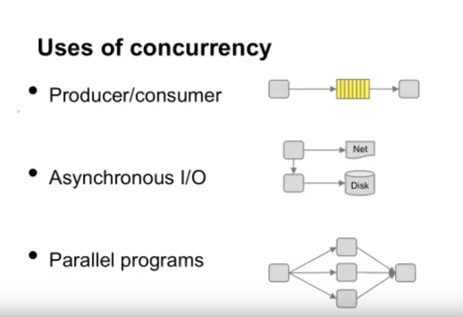

# Concurrency

Concurrency is the ability of a program to run more than one task at a time.

Below are some examples of concurrent scenarios:

## Properties of concurrent systems

Concurrent systems has the following properties:

- Multiple actors.
- Shared resources.
- Rules for access.

For example, if we have a shared bathroom, the actors would be people, the shared resource would be the bathroom and the rules for access would be "one at a time".

In terms of computer systems, we have multiple threads, memory and rules for accessing that memory.

## Benign concurrency

Examples of benign concurrency:

- No shared data/communication.
- Only reading data.

## Risky concurrency

Example of a risky concurrency scenario:

- Two threads accessing a shared resource without any synchronization.
- At least one modifies the resource.

## Which variables are shared

- Local variables are not shared.
- Global variables are shared.
- Heap variables can be shared.

## Managing concurrency

Synchronization mechanism allow programs to write rules for concurrency. The following methods can be used to ensure synchronization:

- Atomicity - ensures no other threads changes data while reading/writing.
- Conditional synchronization - ensure code in different threads run in the "correct" order.

## Race conditions

A race condition occurs when the output is dependent on the sequence or timing of uncontrolled events. For example, if multiple threads enter the critical section at roughly the same time, both attempting to update the shared data structure, leading to a surprising outcome.

In order to handle race conditions, we need a mechanism for controlling access to shared resources in the face of concurrency. Synchronization is necessary for any shared data structure.

## Critical section

A critical section is a section that access a shared resource. We must use mutual exclusion to synchronize its execution.

Critical section has the following properties:

- Mutual exclusion - only one thread at a time.
- Progress - a thread outside the critical section can't stop another from entering.
- Bounded waiting - a thread waiting to enter the critical section will eventually enter.
- Performance - overhead of entering/exiting should be small.
- Fair - don't make some threads wait much longer than others.

## Locks

- Call acquire at the start of a critical section and release it at the end.
- Acquire a lock only blocks threads trying to acquire the same lock (i.e. there can be multiple locks).

Locks have two states:

- Held: Someone is in the critical section.
- Not Held: Nobody is in the critical section.

Locks have two operations:

- Acquire: Mark the lock as held or wait until it gets released.
- Release: Mark the lock as not held.

## Semaphores

A counter that is manipulated atomically through two operations: signal & wait.

- wait - decrement the counter. If the counter is zero then block until semaphore is signaled.
- signal - increase the counter. Wake up one waiting process (if there is any).

Each semaphore has an associated queue of processes/threads waiting to be executed.

If the counter is set to 1, we can think about this semaphore as a lock. However, there is an important distinction. Locks keeps "pinging" the CPU to checks if the lock is available. This can be inefficient if the lock is held for a longer period. Semaphores uses queue and places waiting processors in that queue.

## Deadlock

- A policy that leaves all threads stuck, so that nobody can do anything at all.
- Every thread in the set is waiting for an event (acquire or release of a resource).

For example:

- Thread 1 locked resource A waiting for resource B.
- Thread 2 locked resource B waiting for resource A.