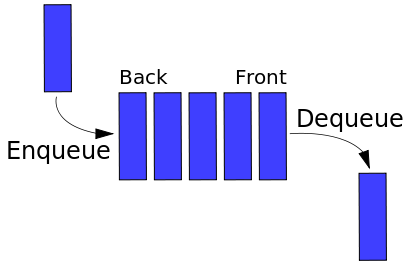

# Data structures

## Linked list

Linked list consists of nodes which contains a value and a pointer to the next node.

### Advantages

- Allows for efficient insertion and removal of any element in the list, by simply changing the pointers.
- Have dynamic size.

### Disadvantages

- Doesn't allow for random access or any form of efficient indexing. Thus, many basic operations, such as obtaining the last node of the list is inefficient.
- Uses more memory than arrays due to the pointers.

The picture below shows an example of a linked list:


## Static Arrays

Static arrays are a data structure consisting of a collection of elements, each identified by an array index. Static arrays has a fixed size. Furthermore, elements can't be inserted/removed (but they can be updated). C's array (i.e. a[n]) is an example of static arrays.

### Advantages

- Easy to access certain indices.
- Often more efficient than linked lists and dynamic arrays, since the memory allocated is done at compile time.

### Disadvantages

- Fixed length.

## Dynamic arrays

Dynamic arrays are similar to static arrays but allows for dynamically change of length. The memory is allocated at run time (not to be confused with dynamically allocated arrays). Python's list is an example of dynamic arrays.

### Advantages

- Accessing and assignment by index is fast.
- Appending object (inserting at the end of array) is relatively fast amortized O(1).

### Disadvantages

- Inserting or removing objects in a random position in a dynamic array is very slow O(n), as it must shift (on average) half of the array every time.
- Unpredictable performance when insertion/removal requires resizing.
- There is often unused space, since dynamic array implementations usually allocates more memory than necessary (since resize is a very slow operation).

## Comparison of performance between the data structures

|                                     | Linked list | Static array | Dynamic array |
|------------------------------------:|------------:|-------------:|--------------:|
| Indexing                            |        O(n) |         O(1) |          O(1) |
| Inserting/deleting at the beginning |        O(1) |           NA |          O(n) |
| Inserting/deleting at the end       |        O(n) |           NA |          O(1) |
| Inserting/deleting at the middle    |        O(n) |           NA |          O(n) |
| Wasted space                        |        O(m) |           0  |          O(m) |

## Stack

Stack is a data structure that serves as a collection of elements. It has two principal operations:

- push, which adds an element to the collection.
- pop, which removes the most recently added element that was not yet removed.

The order in which elements come off a stack follows "last in, first out". A stack can be implemented by a linked list with constant removal/addition time.

The picture below shows an example of a stack:


## Queue

Stack is a data structure that serves as a collection of elements. It has two principal operations:

- Enqueue which adds an element at the beginning of the queue.
- Dequeue which removes an element at the end of the queue.

The order in which elements come off a queue follows "first in, first out". A queue can be implemented by a linked list (by keeping track of the first and last element to ensure constant addition/removal time).

The picture below shows an example of a queue:



## Sets

A set is a data structure that stores unique values without any particular order. Unlike most other collection types, rather than retrieving a specific element from a set, one typically tests a value for membership in a set.

## Hash maps

Hash maps is a data structure that maps keys to values. A hash table uses a hash function to compute an index into an array of buckets, from which the desired value can be found. Hash maps are widely used for rapid data lookup (O(1) lookup time). Python's dictionary is an example of hash maps.

### Hash function

A hash function is any function that maps data (i.e. integers, strings etc.) to indices. The values returned by a hash function are called hash values, or simply hashes.

A good hash function should be:

- Determinism - Hash values must be deterministic, e.g. for a given input value it must always generate the same hash value.
- Uniformity - A good hash function should map the expected inputs as evenly as possible over its output range.
- Defined range - It is often desirable that the output of a hash function have fixed size.

Hash functions usually uses module operations, i.e. value mod X. For integers it is straight forward. For strings, one usually use ASCII characters (i.e. a=1, b=2 etc.).

### Collisions in hash maps

Sometimes, two different values might have the same hash value. Therefore, creating a hash function becomes a trade off between number of buckets and dealing with collisions. Ideally, one would like to have 1-3 entries per bucket. Here are three examples of dealing with hash value collisions:

- Having each bucket contain a linked list of elements that are hashed to that bucket. Worst case, this can lead to O(n) lookups (if all stored values are in one bucket).
- If the hash maps entries are all full then the hash map can increase the number of buckets that it has and then redistribute all elements in the map. However, resizing the map can be costly.
- For each collisions, create a new hash map for that bucket.

## Trees

A tree data structure can be defined recursively as a collection of nodes (starting at a root node), where each node consisting of a value (integer, string etc.) together with a list of references to their child nodes, with the constraints that no reference is duplicated.

The picture below shows an example of an (unordered) tree:


## Binary search tree

A binary search tree has internal nodes, each store a key (and optionally, an associated value) and each have two sub-trees, commonly denoted left and right. The tree additionally satisfies the binary search property, which states that the key in each node must be greater than or equal to any key stored in the left sub-tree, and less than or equal to any key stored in the right sub-tree. The leaves (final nodes) of the tree contain no key and have no structure to distinguish them from one another.

They allow fast lookup, addition and removal of items, and can be used to implement lookup tables that allow finding an item by its key. When looking for a key in a tree (or a place to insert a new key), they traverse the tree from root to leaf, making comparisons to keys stored in the nodes of the tree and deciding, based on the comparison, to continue searching in the left or right subtrees.

It has a worst case complexity of O(n) and an average of O(log n). The same holds for removal and additions.
Below is an example of a binary search tree:

The picture below shows an example of an binary search tree:


## Heaps

A heap is a tree-based data structure that satisfies the heap property: if P is a parent node of C, then the key of P is either

- Greater than or equal to (in a max heap) or,
- Less than or equal to (in a min heap) the key of C.

Search has a complexity of  O(n) and inserting a complexity of O(log n).

Below is an example of a complete binary max-heap:


## Graphs

A graph is a structure amounting to a set of objects in which some pairs of the objects are in some sense "related". The objects correspond to mathematical abstractions called vertices and each of the related pairs of vertices is called an edge. The edges may be directed or undirected.

For example, if the vertices represent people at a party, and there is an edge between two people if they shake hands, then this graph is undirected because any person A can shake hands with a person B only if B also shakes hands with A.

In contrast, if any edge from a person A to a person B corresponds to A's admiring B, then this graph is directed, because admiration is not necessarily reciprocated.

The former type of graph is called an undirected graph and the edges are called undirected edges while the latter type of graph is called a directed graph and the edges are called directed edges.

The follow picture is an example of a directed graph:


The follow picture is an example of a undirected graph:


### Cyclic and Acyclic graph

A cycle is a path of edges and vertices wherein a vertex is reachable from itself. A cyclic graph is a graph that contains at least one cycle. If the graph doesn’t contain any cycles, then it's a acyclic graph.


## Representing graphs

There are several ways to represent graphs, each with its advantages and disadvantages. Here, we'll see three ways to represent graphs.

### Edge lists

One simple way of represent a graph is with a list of |E| edge, called edge list. To represent an edge, we just have an array of two vertex number, that the edge are incident on. The space complexity is O(|E|). The edge list of the acyclic graph above would be:

```python
[[1,2], [1, 3], [2,3]]
```

Edge lists are simple, but if we want to find whether the graph contains a particular edge, we have to search through the edge list. If the edges appear in the edge list in no particular order, that's a linear search through |E| edges.

### Adjacency matrices

For a graph with |V| vertices, an adjacency matrix is a |V|x|V| matrix of 0s and 1s, where the entry in row i and column j is 1 if the edge (i,j) is in the graph. The adjacency matrix of the acyclic graph above would be:

```python
[[0, 1, 1],
[0, 0, 0],
[0, 1, 0]]
```

With an adjacency matrix, we can find out whether an edge is present in constant time, by just looking up the corresponding entry in the matrix, e.g. graph[i][j].

Adjacency matrix has two disadvantages: First, it takes |V|x|V| space, even if the graph is sparse (relatively few edges). Second, if you want to find out which vertices are adjacent to a given vertex i, you have to look at all |V|entries in row i, even if only a small number of vertices are adjacent to vertex i.

For an undirected graph, the adjacency matrix is symmetric. For a directed graph, the adjacency matrix need not be symmetric.

### Adjacency lists

Representing a graph with adjacency lists combines adjacency matrices with edge lists. For each vertex i, store an array of the vertices adjacent to it. We typically have an array of |V| adjacency lists, one adjacency list per vertex. The adjacency list of the acyclic graph above would be:

```python
[[2, 3], [], [2]]
```

Vertex numbers in an adjacency list are not required to appear in any particular order, though it is often convenient to list them in increasing order.

We can get to each vertex's adjacency list in constant time, because we just have to index into an array. To find out whether an edge (i,j) is present in the graph, we go to i's adjacency list in constant time and then look for j in i's adjacency list. Worst case this takes O(d), where d is the length of the i's adjacency list. The length could be as high as |V|-1 (if i is adjacent to all the other |V|-1 vertices) or as low as 0 (if i is isolated, with no incident edges). In an undirected graph, vertex j is in vertex i's adjacency list if i is in j's adjacency list.

How much space do adjacency lists take? We have |V| lists, and although each list could have as many as |V|-1 vertices, in total the adjacency lists for an undirected graph contain |E| elements, since Each edge (i,j) appears exactly twice in the adjacency lists. For a directed graph, the adjacency lists contain a total of |E| elements, one element per directed edge.
