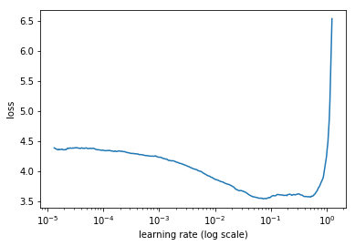
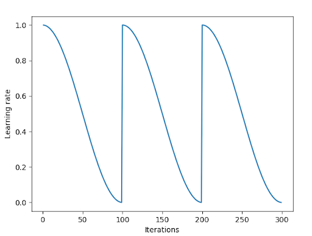
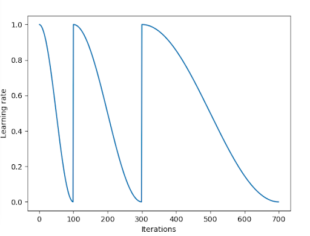

# Notes from the course “Deep Learning for Coders” (2018)

## Lesson 2

### Automatic learning rate finder
One automatic way of finding a good learning rate is to start with a low learning rate and then increase it after each batch. After a while the loss will start to increase. Pick the learning rate where the loss decreases the most. In the example below, 1e-2 would be a good learning rate.

### Cosine learning rate annealing with restarts

Cosine learning rate annealing changes the learning rate according to a cosine function with restarts. The rationale behind the restart is that we want minimums that generalize well. The restart helps us find these minimum by escaping “weak” minimums.

In the previous example the cycle length are constant. However, sometimes we want to increase the number iterations per cycle as function of iterations, as in the example below. This is especially true if the training loss is greater than the validation loss.

### Differential learning rates

Sometimes we want different learning rates for different layers. The learning rate should most likely be lower for the layers in the beginning of the network.

For example: [1e-5, 1e-4, 1e-3], where 1e-5 is for the earliest layers, 1e-4 is for the middle layers and 1e-3 is for the fully connected layers. As we can see in the example above, the learning rate decreases with a factor of 10 for each section.

As a rule of thumb, they should decrease with a factor of 3-10x at each section, depending upon how similar they are to the original transfer model’s data.

For example, assume that we have a model that is trained on ImageNet. If our task is to classify cats/dogs then we probably want to decrease it less, i.e. 3 times, since it is fairly similar to ImageNet dataset. However if we work with medical or satellite images we probably want to decrease it more, i.e. 10 times.

### Transfer learning

When doing transfer learning, it is a good idea to freeze the feature extraction layers and find “okay” fully connected layers. Then we can unfreeze all layers and train them with differential learning rates as described above.

For the transfer model, ResNet34 trained on ImageNet is a good start. After that, one might want to try ResNext50.

### Data augmentation

Try choosing data augmentation (i.e. flip vertically/horizontally etc.) that makes “sense”, flipping upside down does not make sense for cats/dogs but it does for satellite images. Another trick is to train on smaller images and switch to larger ones later, preventing overfitting. However, this assumes that we have used a model which does global pooling in the last layer.

Easy steps to train a good image classifier:

- Find the learning rate with the automatic learning rate finder.
- Train the last layer with data augmentation for 2-3 epochs with a cycle length of 1.
- Unfreeze all layers.
- Set earlier layers to lower learning rate than the last layer.
- Train the full network with a cycle length of 2 until we reach overfitting.

## Lesson 3

### Number of channels < 3

If the number of channels < 3 we could copy the existing channels such that the number of channels becomes 3. This is done in order to use transfer learning.

### Multi-label classification

For some problems we have multiple classes per image, i.e. an image containing a dog and a cat but not a boat. In these cases, we use a sigmoid unit as the output for each class, for example probability 90% of a cat, 80% of a dog and 0.1% probability of a boat. Note that the sum of the probabilities over all classes does not need to add up to 1.

### Type of data sets

There are two common types of datasets in machine learning:

- Unstructured data, i.e. images, text, audio signals etc.
- Structured data, i.e. grocery sales, house prices etc. These have a "SQL"-like structure.

## Lesson 4

For dropout, p=0.5 is a good default (p - probability of dropping).
One usually doesn't bin continuous variables into categorical ones.

If a feature is discrete (e.g. store id, city etc.), it is usually a good idea to make it categorical.  Then we can use entity embedding to learn a representation of those features (in PyTorch torch.nn.embedding). One can think about the torch implementation as a one-hot encoding, but instead of doing a matrix multiplication we use a lookup table (which requires less computation).
For unknown categorical features (e.g. store id’s that is not in the training set), one can use a special tag (e.g. ukn), which gets its own embedding vector.

A rule of thumb for the dimension of the embedding vector is: min(50, (c+1)/2), where c is the cardinality of the feature, i.e. 8 for weekday (one extra due to the ukn tag). This rule of thumb is applied to structured data/time series data.

The embeddings is a case of distributed representation learning, i.e. every dimension has a “little bit of information of many concepts”. This is a fundamental concept in deep learning. Embedding layers are good for all categorical features. Usually doesn't want to high of a cardinality, but use it on as many categorical features as possible.

## Lesson 5

Language modelling: Given some words in a sentence, predict the next word in the sentence. Note that it doesn’t necessary need to be words, we could use letters etc.

Assume that we wish to do sentiment analysis. One way to pre-train/do transfer learning for this task is to pre-train a language model. Then re-train the model to classify sentiment. Jeremy suggests that pre-trained language models outperforms word embeddings (e.g. word2vec, Glove etc). The cardinality of embeddings for words are usually 5-600.

For the optimizer, one usually uses Adam with beta=(0.7, 0.99).

A new interesting model for language modelling is the AWD LSTM.

Spacy is a good python package for tokenizing.

## Lesson 6

The neural network approach to collaborative filtering works better for missing value compared to SVD, since we will only use movies that an user has actually watched. With SVD we need to fill movies that an user hasn’t seen with 0.

With neural network embeddings, the movie bias can be interpreted as how good the movie is (if we predict ratings) and the weights are the “normal” embeddings.

Character level language models are good when we have a lot of unusual words (compared to word level ones).
Usually, we initialize the hidden state of RNNs with zeros, however we could use the identity matrix instead, to help preventing exploding/vanishing gradients.

## Lesson 7

Common to use convolutional layers with stride 2 instead of max-pooling in state-of-art models (to reduce the size of the feature maps). Also, the last layer is usually an adaptive pooling layer (i.e. the output shape is independent of the input shape). With fast.ai pre-trained models, they use adaptive max pooling and adaptive average pooling (i.e. concatenating them).

Batch norm (BN) is applied per channel in convolutional networks. With batch norm, we can exclude the bias term. If the layer is frozen, we don’t want to update the statistics (mean and std) of BN layers, since updating these will change the layer’s “meaning”. Batch norm usually works well and should be used, if possible. However one should be aware that if the input distribution changes (e.g. transfer learning), batch norm can cause problems.

For state-of-art convolutional models, one usually use 5x5 or 7x7 kernel size for the first layers with a large increase in the number of channels, to give a “richer” starting point for the network. The kernel size of the other layers are usually 3x3.

The resnet model is inspired by boosting, i.e. fitting the residual. One resnet block usually have two convolutional layers.
