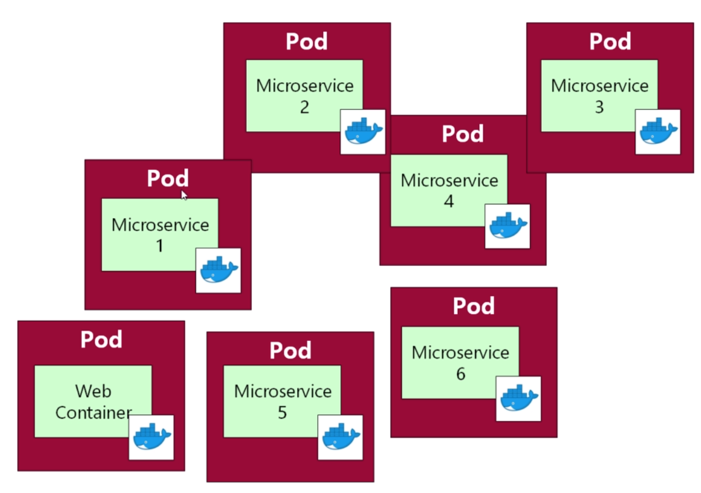
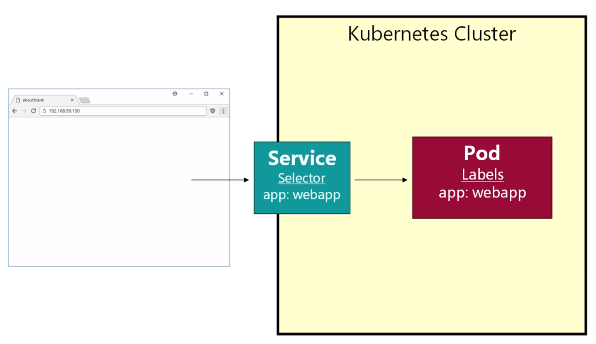
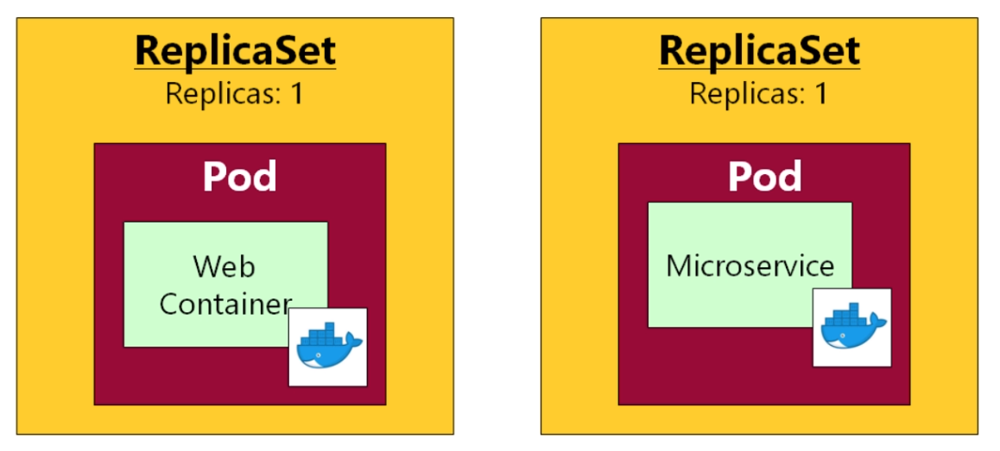
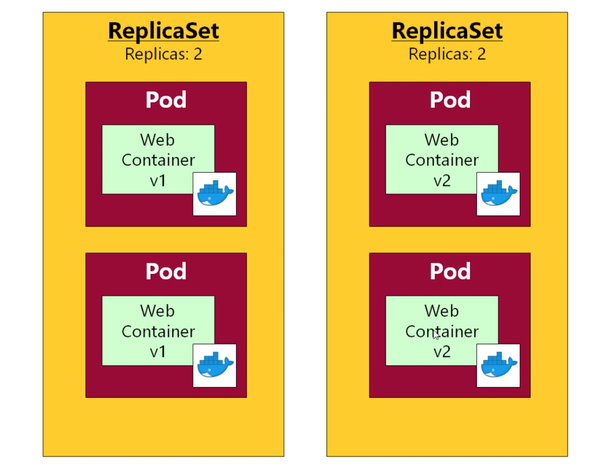

# Kubernetes course notes

## Kubernetes

- Kubernetes is used for automating deployment, scaling, and management of containerized applications.

## Pod
- A pod is one or more containers with shared storage / network and a specification for how to run the containers.
- Think of pods as a wrapper for a container, for most cases container == pod.
- Can have helper containers for a microservice in a pod (i.e. log processor), however best pratice is not to have two micro-services in one pod.
- In general, users shouldn’t need to create Pods directly. They should almost always use controllers.
- By default, pods are only accesible from within the Kubernetes cluster. 
- Pods are "mortal", i.e. they get created, destroy etc. Therefore, it is hard to keep-track of pods ip-adresses etc. Services are used to solve this problem.
- Each pod has a unique IP address, even pods on the same node.

## Service
- In Kubernetes, a service is an abstraction which defines a set of Pods and a policy by which to access them.
- Services enable a loose coupling between dependent Pods.
- Services are long-lived object in Kubernetes.
- Services can be connected to internally (type=ClusterIP) or externally (type=NodePort).
- Services connect pods by selectors.
- We can use any selectors name and multiple of them. If we have multiple then it will be an AND operator, i.e. all of the selectors from the service need to match the labels on the pods.

## Replica-sets
- In a deployment setting, rarely deals with pods directly.
- If we deploy pods ourselves, we are responsible for managing them, i.e. restart on crashes etc.
- Instead if we use relica-sets, it will take care of managing the pods, i.e. making sure there is always 3 pods up.
- Should almost always deploy replica-set instead of pods (but replica-set creates and manages pods).
- Replica-set yaml-files is a combination of pod & replica yaml-file, think of it as extra-configuration to Kubernetes.

## Deployments
- One can think about the deployment entity as a sophisticated replica-set. It gives automatic updated with zero-downtime, roll-back etc.
- Deployment creates replica-sets; think of a deployment as an entity that manages replica-sets.
- If we roll-out a new replica-set, the old replica-set will still be online, but with no replicas (i.e. pods). This allow us to roll back to a previous replica-set if our new version causes problems.
- In most cases it's better to use deployments instead of replica-sets, since the API is very similar but deployments has more functionality.

