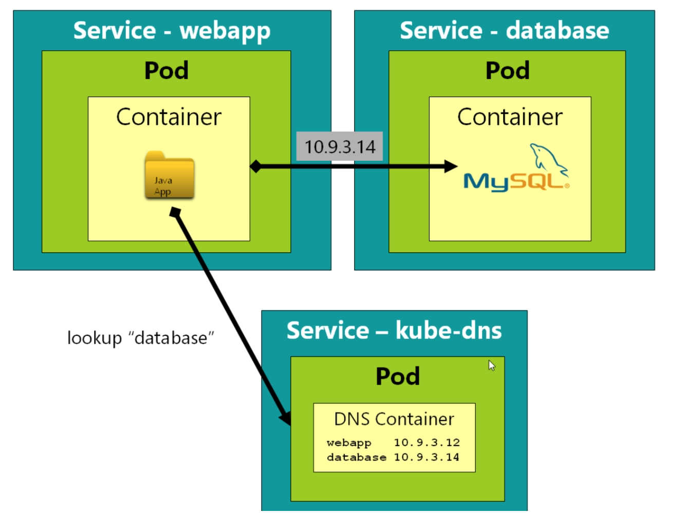
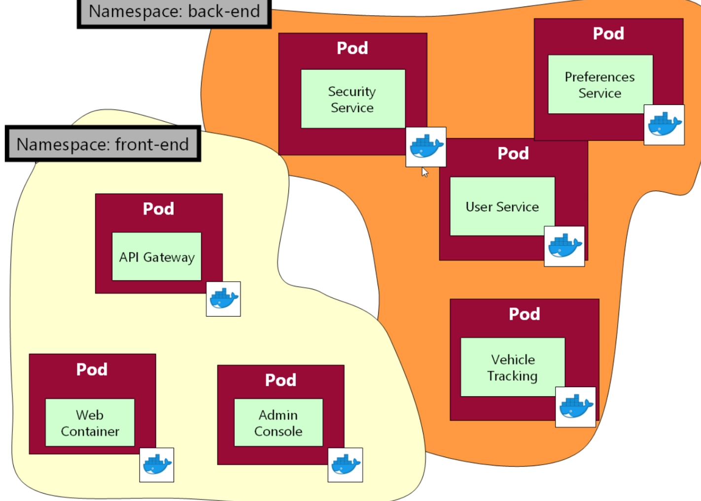
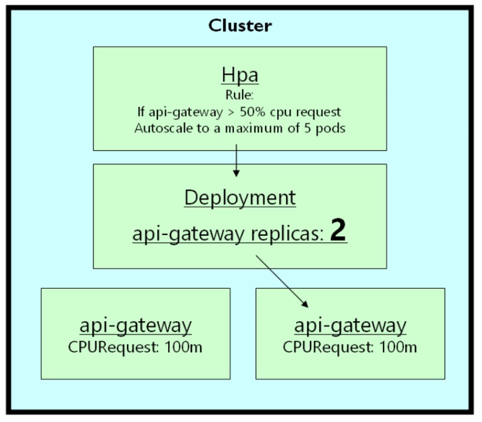

# Kubernetes course notes

## Kubernetes

- Kubernetes is used for automating deployment, scaling, and management of containerized applications.

## Pods
- A pod is one or more containers with shared storage / network and a specification for how to run the containers.
- Think of pods as a wrapper for a container, for most cases container == pod.
- Can have helper containers for a microservice in a pod (i.e. log processor).
- Best pratice is to have only one container in one pod.
- In general, users shouldn’t need to create Pods directly. They should almost always use controllers.
- By default, pods are only accesible from within the Kubernetes cluster.
- Each pod has a unique IP address, even pods on the same node.
- Pods are "mortal", i.e. they get created, destroy etc. Therefore, it is hard to keep-track of pods ip-adresses etc. Services are used to solve this problem.

## Services
- In Kubernetes, a service is an abstraction which defines a set of Pods and a policy by which to access them.
- Services enable a loose coupling between dependent Pods.
- Services are long-lived object in Kubernetes.
- Best pratice is to use different services for different types of pods (e.g. one service for the javascript front-end and one for the MYSQL database).
- Services can be connected to internally (type=ClusterIP) or externally (type=NodePort).
- Services connect pods by selectors.
- We can use any selectors name and multiple of them. If we have multiple then it will be an AND operator, i.e. all of the selectors from the service need to match the labels on the pods.
- Routing between pods are done by round-robin, by default.

## Replica-sets
- In a deployment setting, rarely deals with pods directly.
- If we deploy pods ourselves, we are responsible for managing them, i.e. restart on crashes etc.
- Instead if we use relica-sets, it will take care of managing the pods, i.e. making sure there is always 3 pods up.
- Should almost always deploy replica-set instead of pods (but replica-set creates and manages pods).
- Replica-set yaml-files is a combination of pod & replica yaml-file, think of it as extra-configuration to Kubernetes.

## Deployments
- One can think about the deployment entity as a sophisticated replica-set. It gives automatic updated with zero-downtime, roll-back etc.
- Deployment creates replica-sets; think of a deployment as an entity that manages replica-sets.
- If we roll-out a new replica-set, the old replica-set will still be online, but with no replicas (i.e. pods). This allow us to roll back to a previous replica-set if our new version causes problems.
- In most cases it's better to use deployments instead of replica-sets, since the API is very similar but deployments has more functionality.

## Service discovery
- Kubernetes manges it's own internal dns-service, i.e. mapping services to ip addresses.
- The internal dns service is called kube-dns.
- This allow us to easily find the ip-address of different services and makes communications between services easier.
- Can use the linux command nslookup "database" to find the ip-address of the database-service.
- Note that is only works if we are in the same namespace as the service we are looking up.
- If we are in a different namespace, then we need to use "database.mynamespace" or the fully qualified domain name "database.mynamespace.svc.cluster.local".

## Namespaces
- Namespaces is a way to partion your resources into seperate areas.
- If we don't give a namespace, the resouces will go to the "default" namespace.
- The same is true if we try to do some command, e.g. kubectl get all, then it will display the resources in the "default" namespace.

## Persistence
- When a pod is destroyed, all of the data inside the container is lost (including local storage).
- By default, all data (e.g. in databases) are stored locally on the container, and if they dies, all data is lost.
- We can store data on a persistance storage, e.g. on the filesystem on the host, real hard drive in a cloud environment (outside the kubernetes cluster) etc. If we do, the data will still exist, even if the pod are destroyed.
- We can mount storage, i.e. map a folder inside the container to a folder on the host-system, i.e. the data is stored outside the container.
- We can configure Kubernetes to implement the mapping using different strategies, using the host system, outside storage (e.g. Amazon EBS-system) etc.
- Best pratice is to define the storage outside the pod definition, i.e. in PersistentVolumeClaim / PersistentVolume yaml-files. This makes it easier to migrate between local development and between cloud providers (AWS, Azure etc).

## Requests and limits
- In kubernetes, we can specify request and limit of CPU and memory of each container.
- Request is specified inorder to let the scheduler know where it can put the pods (i.e. on which node), however it doesn't affect the runtime. For example, if a pod has a memory leak it can use all of the memory on a node, even if the request is set below the node's total memory.
- Limit restrict the pod's resources, i.e. it can not use more then the specified values. Therefore it affects the runtime of the container.
- Memory limit: if the actual memory usage of the container at runtime exceeds the limit the container will be killed; the pod will remain, the container will therefore attempt to restart.
- CPU limit: if the CPU usage of the container at runtime exceeds the limit, the CPU will be "clamped" (i.e. throttling). However, the container will continue to run.
- The point of limits is to protect the overall health of a cluster.
- These values should be set such that the container can run comfortable.
- The limit-values needs to be atleast as high as the request-values.
- If a node doesn't have enough ram for scheduling a pod, the pod will fail / give error and we have to schedule it on another node.
- For CPU-values we can use fractions, i.e. 0.1. It is common to use the postfix m, e.g. 100m; 100m = 100 mili-cores, i.e. 0.1 CPU.
- For memory, its common to use M/Ki postfix, i.e. 1 Mi = 1024 Ki.

## Resource profiling
- We can use the the kubectl top command to profile the memory and CPU usage of each pod. This can give us a hint of what a good request / limit value is (metrics-server needs to be enabled in order to use this command).
- We can also use the kubernetes-dashboard to profile the usage (dashboard needs to be enabled in order to use it).
- In general, setting good request / limit values are context dependent. It depends on the frameworks and languages used etc. Needs to be tune based on our needs.
- Setting request values are good since it allows the scheduler to make good "decision" (and essential for horizontal auto-scaling). Limits are less essential, but good if we suspect that we might have runtime problems, e.g. memory leaks.

## Horizontal pod autoscaling
- Kubernetes has the ability to horizontally autoscale pods, i.e. replicating pods.
- Horizontal scaling: improve capacity of the system by creating more instances (i.e. more nodes / pods).
- Vertical scaling: make the nodes more powerful (more RAM / CPU).
- For autoscaling, only need to define the request field (not limit).
- Note that not every application can be replicated, it depends on how we design the software. For example, stateless application are easy to replicate.
- Stateless: the application doesn't contain any information it needs to share with other applications.
- In general, databases are hard to replicate.
- Kubernetes is conservative when scaling down; the scale down process starts when the metric is below the target for several minutes.

