# MongoDB - The Complete Developer's Guide

## MongoDB basics
- MongoDB is a NoSQL database.
- NoSQL is "all about flexibility".
- In NoSQL we don't normalizing the data (i.e. in SQL we store the data at multiple places / tables).
- Can lead to messy data, however its up to the developer to make sure this doesn't happen.
- In MongoDB, each database consist of multiple collections (collections ≈ tables in SQL).
- In each collections there are multiple documents (documents ≈ rows in SQL).


## MongoDB backend structure

- MongoDB is popular for heavy read & write applications.
- As an application developer, we interact with the MongoDB server, which in turn is responsible for communicating with the storage engine (the default is WiredTiger). The storage engine then accesses data / files from the file-system.
- We can communicate with the MongoDB server either from the drivers or from the MongoDB shell.

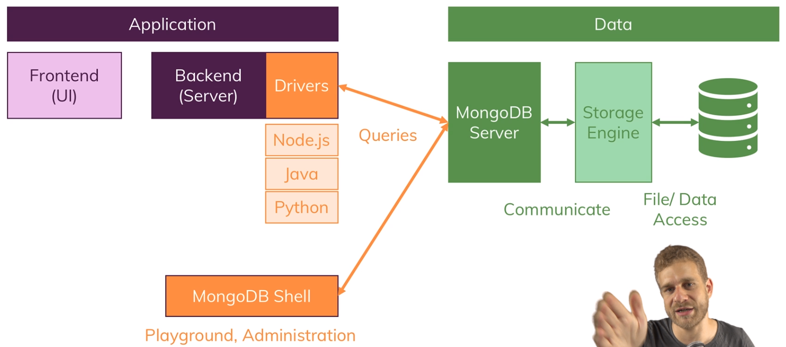

## Data format

- MongoDB stores data in BSON (binary version of JSON).
- However when inserting documents, we use JSON, which then gets converted to BSON.

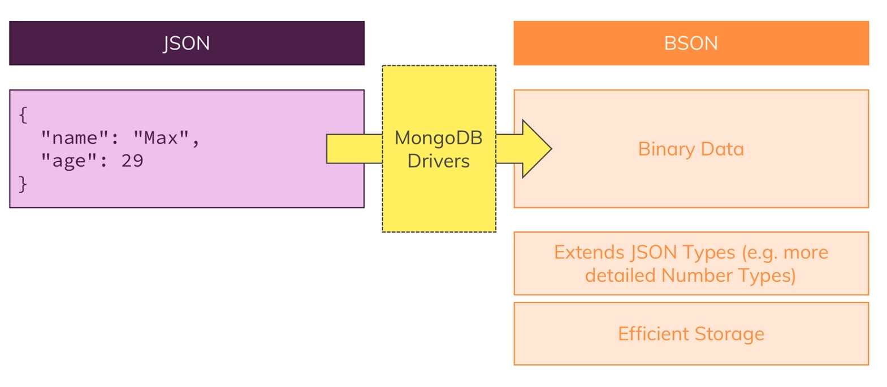

## CRUD operations
- CRUD stands for Create, Read, Update and Delete and are common commands in MongoDB.

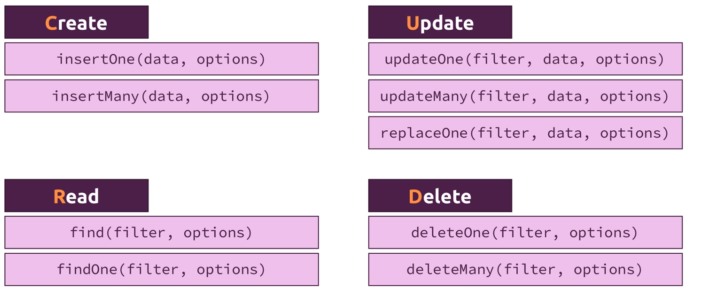

## Operators
- In MongoDB we have operators that are used in CRUD. They are query, projection and update.
- The query operators are used to locate data. They are used in read, update and delete commands.
- The projection operators are used to transform data. They are used in the read commands.
- The update operators are used to modify data. They are used in the update commands.
- Below are the documentation of different operators:
  - [Query and projection operators](https://docs.mongodb.com/manual/reference/operator/query/)
  - [Update operators](https://docs.mongodb.com/manual/reference/operator/update/)

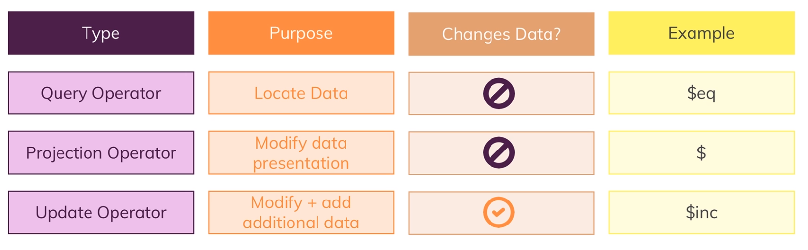

## Cursors
- When using fetch-multiple-data-command such as collection.find() MongoDB doesn't return the data but a cursor object.
- This used since we might get thousands or even millions of return documents, and returning them in one batch would be inefficient.
- From the cursor object we can fetch the data by .toArray() or similar command.
- Think of them as similar to Python's iterators.

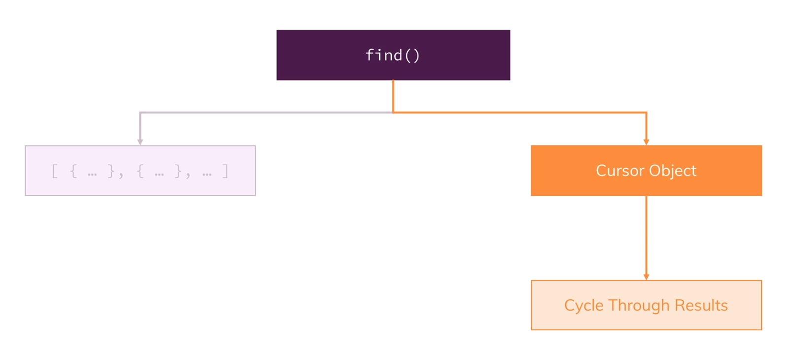

## Projections
- Sometimes we only want to return some fields of the documents.
- We could fetch all documents and them only keep the desired fields, however this would require more bandwidth.
- Instead we can use projections, which allow us to do these operations in the database and only return the stripped down version of the data.
- The command follow .find(query, {key: value}), where key is the field/s we want to keep / remove.
- Value 1 means keep and 0 means drop. Note that all fields have the default value 0, except the _id field which has the default value 1.
- E.g. .find({}, {name: 1, _id: 0}) would only return the name field.

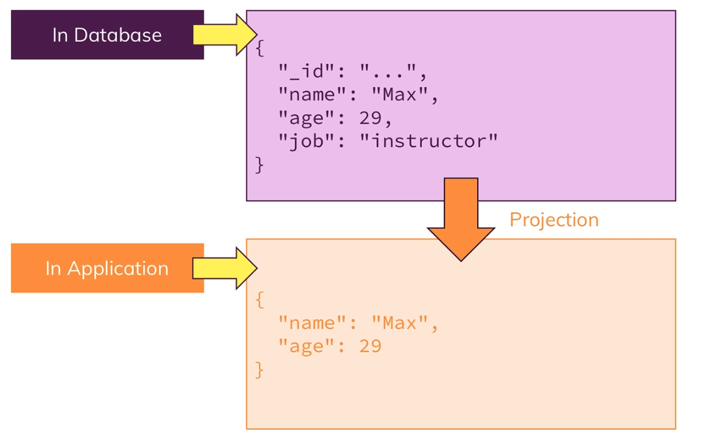

## Embedded Documents:
- Field in documents can be another document, i.e. nested documents.
- Note that the nested document can have their own id's field.

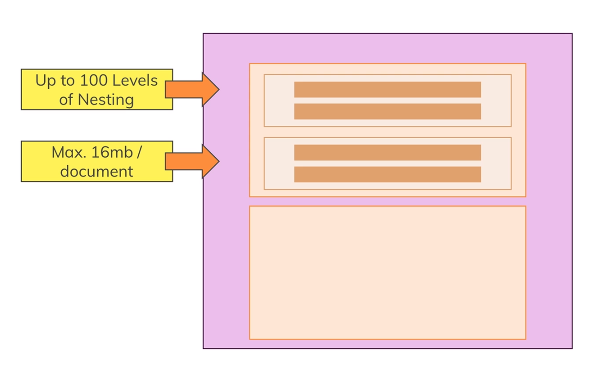

## Schemas

- In NoSQL we can store different types of data in the same collection.
- However, it is usually a good idea to separate the data into different collections based on their types (i.e. the extra data example below).
- Yet, requiring the documents to have the exact same fields defeats the purpose of NoSQL.

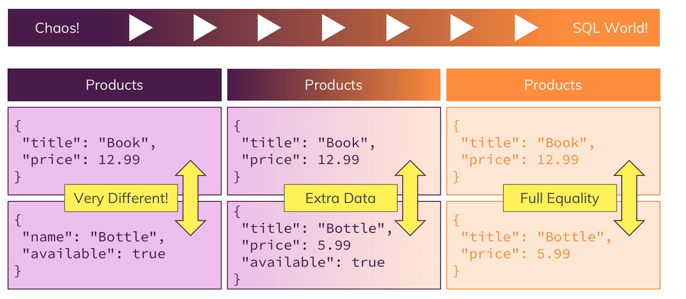

## Schema-validation
- In MongoDB we can have schema-validation, i.e. inserted / updated documents needs to have a specific structure with specific data-types in order to get inserted.
- We can set the validation level to "strict" (all inserts & updates are checked) or "moderate" (all inserts & updates to correct document).
- We can set the validation action to "error" (throw error and deny insert/update) or "warn" (log warning but proceed).
- It is easiest to insert the validation schema when creating the collection (see below for example).
- However, we can also update an existing schema with db.runCommand({"CollMod": "posts", validator: {...}}).

```javascript
db.createCollection('posts', {
  validator: {
    $jsonSchema: {
      bsonType: 'object',
      required: ['title', 'text', 'creator', 'comments'],
      properties: {
        title: {
          bsonType: 'string',
          description: 'must be a string and is required'
        },
        text: {
          bsonType: 'string',
          description: 'must be a string and is required'
        },
        creator: {
          bsonType: 'objectId',
          description: 'must be an objectid and is required'
        },
        comments: {
          bsonType: 'array',
          description: 'must be an array and is required',
          items: {
            bsonType: 'object',
            required: ['text', 'author'],
            properties: {
              text: {
                bsonType: 'string',
                description: 'must be a string and is required'
              },
              author: {
                bsonType: 'objectId',
                description: 'must be an objectid and is required'
              }
            }
          }
        }
      }
    }
  }
});
```

## Data types
- MongoDB can handle multiple data-types:
    - Text: "Max".
    - Boolean: true
    - Number:
        - Integer (int32): 32
        - NumberLong (int64): 2313123123
        - NumberDecimal (float64): 3.556
    - ObjectId: ObjectId("34asd4444fghh")
    - ISODate: ISODate("2018-09-09")
    - Timestamp: Timestamp(11421532)
    - Embedded Document: {"a": {...}}
    - Array: {b: [...]}
- Note that if we insert a number from the shell it will be of type float64. This is because the shell is based on javascript.
- This might differ for driver in other languages, e.g. Java.

## References versus embedded documents
- For some applications we need relationships. For example if we have created an online forum, we will have users and posts, and there will be relationships between the users and posts.
- We have two options: references or embedded documents.
- For references, we keep an reference (e.g. id-field) s.t. we can lookup the required document fast.
- For embedded documents, we embed the sub-document within our "main" document.
- There are three types of relationships commonly discussed, one-to-one, one-to-many, many-to-many.
- There are some rule-of-thumb for when to choose which type (i.e. references or embedded), however the choice is context dependent.
- One must always think about how the data is fetched, how often its fetched, does the data change a lot, gets remove etc.

### References
- Split data across collections.
- Great for related but shared data as well as for data which is used in relations and standalone.
- Allows you to overcome nesting and size limits (by creating new documents).
- Can use MongoDB's $lookup command for accessing the reference-data.

#### Reference example
```json
{
    "_id": "uid",
    "username": "user",
    "posts": ["id_1", "id_2"]
}

{
    "_id": "id_1",
    "title": "post 1",
    "text": "topic 1"
},
{
    "_id": "id_2",
    "title": "post 2",
    "text": "topic 2"
}
```

### Embedded documents
- Group data together logically.
- Great for data that belongs together and is not really overlapping with other data.
- Avoid super-deep nesting (100+ levels) or extremely long arrays (16 mb size limit per document).

#### Embedded example
```json
{
    "_id": "uid",
    "username": "user",
    "posts": [
        {"title": "post 1", "text": "topic 1"},
        {"title": "post 2", "text": "topic 2"}
    ]
}
```

## One-to-one
- One-to-one often uses the embedded document structure, however depends on the application.
- Example of one-to-one relationship:

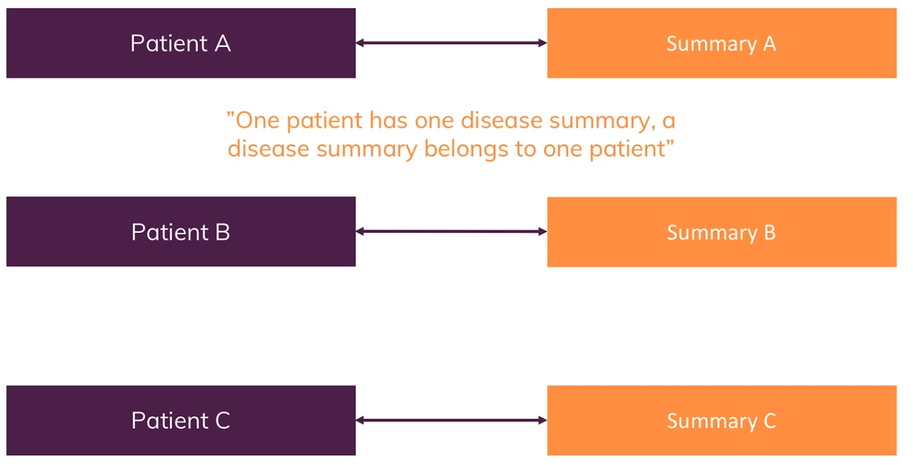

## One-to-many
- One-to-many often uses the embedded document structure, however depends on the application.
- Example of one-to-many relationship:

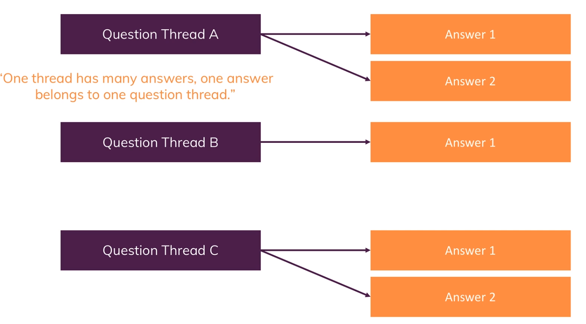


## Many-to-many
- Many-to-many often uses the references structure, however depends on the application.
- Example of many-to-many relationship:

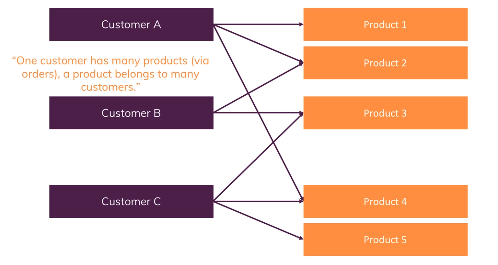

## Indices
- In MongoDB we can create indices on different fields. They allow us to search / sort values fast.
- Internally, MongoDB uses B-trees to store an index, which allow us to search in O(log n) instead of O(n).
- Here is a good article how indices [work](https://www.qwertee.io/blog/postgresql-b-tree-index-explained-part-1/). Note that this article is for Postgres, however the same data structure is used in MongoDB. It also covers compound index.
- Note that we don't want to create too many indices since they require disk space and makes inserts slower since we need to add every new document to the B-tree.
- Also, searching with indices (IXSCAN) are not always faster than a full scan (COLLSCAN). When we want to return all / large portion of the documents, a COLLSCAN can be faster than IXSCAN, since we have the extra step of going through the index.
- We can create an index on multiple fields, called compound index. Note that the key-order matters when we create the index.
- E.g. the index {age: 1, gender: 1} allow us to do IXSCAN on (age, gender) and age, but not (gender, age), i.e. left to right. 
- Therefore one should think hard about which compound indices are required, based on the expected queries.
- Since an index is in sorted order, it allows us to do fast sorts based on that index. However, for compound indices the order matters as for search, i.e. left to right.
- Note that sorting large documents might require an index, since MongoDB will read all documents to memory when sorting without an index and MongoDB has a limit of 32 MB of documents in memory.

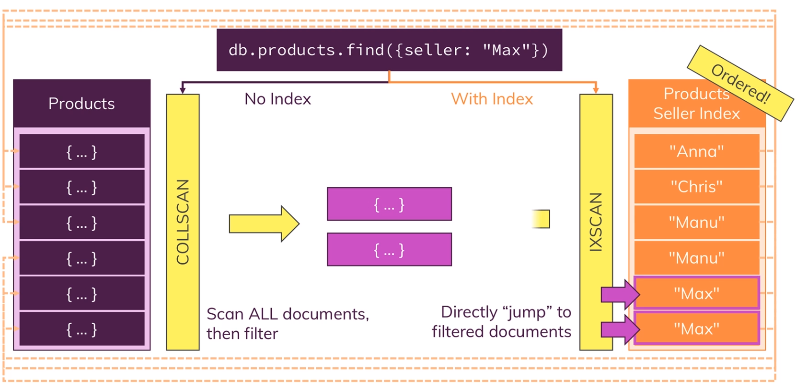

## Index options
- We can create an index that requires unique keys. Note that a missing field counts as a key value.
- We can create a partial index. This will only create the index for some specified values, e.g. age > 60. For the other values, i.e. age < 60, we will do a regular COLLSCAN. This allows us to save disk space and to do faster inserts.

## Multi-key index
- We can create an index based on an array / nested document. This is called multi-key index.
- Internally, MongoDB stores each element in the array as a key, which reference the document.
- Therefore, multi-key indices are larger than single ones.
- For compound index we can only have one multi-key index.

## Text index
- Text indices is an example of a multi-key index.
- To create one, we use db.collection.createIndex({field: "text"}), this converts the text into an array of words which allow us to search for individual terms.
- It does stemming, remove stop words, punctuations etc.
- When searching for keywords, each returned document gets a score which is based on term-frequency.
- We can only have one text index per collection, however we can combine multiple field in one text index.

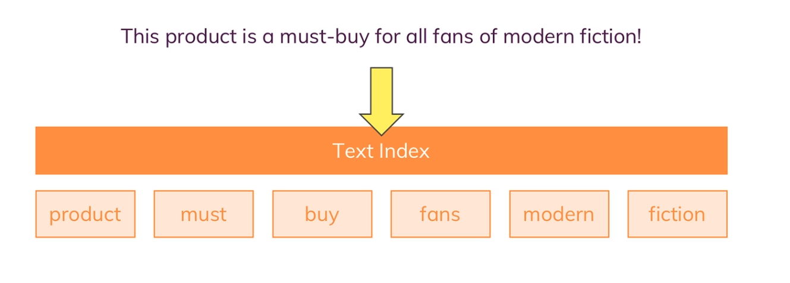

## Building indices
- By default MongoDB builds an index in the foreground, i.e. the collection is locked during the creation. 
- However during a production setting we would like to do it in the background, i.e. the collection is accessible during index creation.
- This can be configured when we create the index.
- Building the index in the foreground is usually faster and recommended during development.

## Choosing winning strategy
- When executing a query, MongoDB usually performs a "test" to see which index to use (if applicable) or to do a COLLSCAN.
- It begins to check which indices could be helpful.
- From these "helpful" indices it perform the query on a subset of the data to see which one is the fastest, which will be used.
- It will cache the winning strategy and reuse it on similar queries.
- The cache is emptied after:
  - 1000 writes.
  - The index is rebuilt.
  - An index is removed / added.
  - MongoDB server is restarted.

## Aggregation
- Aggregation is a way to transform and aggregate data in MongoDB.
- Aggregation returns a cursor.
- Note that MongoDB does optimization on the aggregation pipeline under the hood.
- The aggregation documentations can be found here [here](https://docs.mongodb.com/manual/aggregation/).

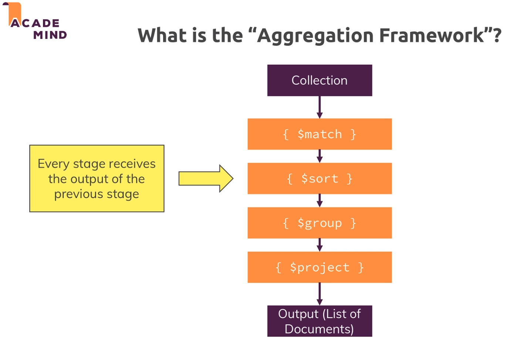
